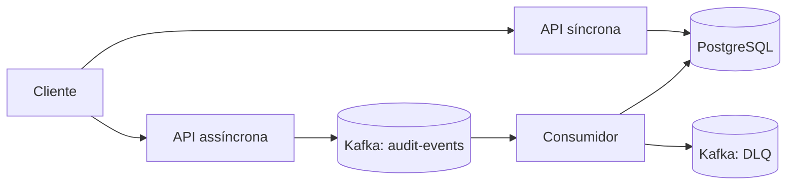

# Implementação Java — protótipo experimental de auditoria

## Finalidade e estado

Três processos executáveis implementam o mesmo contrato `AuditEvent`: `sync-api` grava antes da resposta `201`; `async-api` responde `202` após o ACK do Kafka; `consumer` grava o evento, controla tentativas/DLQ e só então confirma o offset. `audit-core` e `audit-storage` são bibliotecas compartilhadas. Esta é a implementação usada na [Entrega 03 em Java](../entregas/entrega-03-java/README.md). A versão Python anterior permanece no histórico do repositório, sem que seus resultados sejam atribuídos a este código. A comparação quantitativa definitiva ainda não foi executada.

O build e os testes unitários são executáveis com o Maven Wrapper. O [workflow GitHub de 29/09/2026](https://github.com/ilann47/TCC-2026/actions/runs/36627197788) passou nos testes, no smoke Docker REST/Kafka/PostgreSQL e no smoke C4 de interrupção/recuperação do banco. Em 29/09/2026, o ambiente local WSL também iniciou os cinco serviços permanentes: as duas APIs retornaram `/health` 200; um POST síncrono retornou 201 e pôde ser consultado; um POST assíncrono retornou 202 e foi encontrado no banco após o consumidor processá-lo. Isso verifica o funcionamento básico, **não** fornece resultados quantitativos definitivos.

## Arquitetura



`async-api` não possui dependência de banco de dados. Os três processos compartilham o esquema do evento, o algoritmo de hash e os marcos de observabilidade. Há uma única tabela de domínio: `audit_records`. O `persisted_at` é o instante de inserção atribuído pelo banco, **não** a medição do commit; a medição de conclusão usa `commit_completed.wall_time_ns`.

| Módulo | Papel | Dependências externas em execução |
|---|---|---|
| `audit-core` | Contrato, JSON canônico, SHA-256, publicação Kafka, marcos | Nenhuma conexão própria |
| `audit-storage` | Migração Flyway, JDBC, transação e idempotência | PostgreSQL |
| `sync-api` | `POST /audit`, `GET /audit/{event_id}`, saúde | PostgreSQL |
| `async-api` | `POST /audit`, saúde | Kafka |
| `consumer` | Consumir, persistir, tentar novamente e enviar à DLQ | Kafka e PostgreSQL |

## Requisitos

- JDK 21 ou superior. O alvo de bytecode é Java 21.
- Docker com Compose para execução integrada. As portas padrão exclusivas desta versão são `18002` (API síncrona), `18003` (API assíncrona), `15433` (PostgreSQL) e `19093` (Kafka).
- Não é necessário instalar Maven globalmente: `mvnw.cmd`/`mvnw` baixa a versão fixada.

## Build e testes unitários

No PowerShell, dentro desta pasta:

```powershell
.\mvnw.cmd verify
```

No Linux/macOS: `./mvnw verify`. Os testes atuais cobrem um vetor de referência de JSON/hash, validação básica do contrato, confirmação do offset após persistência, DLQ para evento inválido, exaustão de tentativas e ausência de commit quando o ACK da DLQ falha. Eles **não substituem** um ensaio de integração com serviços reais.

## Execução isolada com Docker

O arquivo `.env` versionado contém apenas uma **senha pública de desenvolvimento local** e as portas padrão. Não a reutilize em outros sistemas nem use este ambiente com dados reais. No WSL/Linux, dentro de `implementacao-java`:

```bash
docker compose up --build -d
docker compose ps
```

Para acompanhar a inicialização: `docker compose logs -f --tail=100`. Se quiser uma senha própria, crie `.runtime/compose.env` a partir de `.env.example`, preencha `POSTGRES_PASSWORD` e use `docker compose --env-file .runtime/compose.env up --build -d`. A pasta `.runtime` permanece ignorada pelo Git. Uma senha nova no arquivo não altera automaticamente a senha de um volume PostgreSQL já inicializado.

Exemplo de evento para ambas as APIs:

```json
{
  "event_id": "123e4567-e89b-12d3-a456-426614174000",
  "event_type": "created",
  "entity_type": "order",
  "entity_id": "E1",
  "actor_id": "A1",
  "source": "manual",
  "occurred_at": "2026-09-29T12:34:56Z",
  "payload": {"value": 1}
}
```

Envie esse JSON para `http://localhost:18002/audit` (síncrono) ou `http://localhost:18003/audit` (assíncrono), com `Content-Type: application/json`. Para consultar, use `GET http://localhost:18002/audit/123e4567-e89b-12d3-a456-426614174000`. Não reutilize esse `event_id` com conteúdo diferente: a resposta será `409` na variante síncrona e a mensagem irá para a DLQ na assíncrona.

Para desligar sem apagar dados: `docker compose down`. O comando `down -v` apaga os volumes desta versão; use-o apenas se desejar descartar deliberadamente o banco e o Kafka locais.

## Contratos e significado das confirmações

| Operação | Sucesso | Significado |
|---|---:|---|
| `POST /audit` síncrono | `201` | A transação de persistência terminou; `status=persisted` ou `duplicate`. |
| `POST /audit` assíncrono | `202` | O broker confirmou a publicação; a persistência ainda pode estar pendente. |
| `GET /audit/{event_id}` síncrono | `200` | Registro presente; `404` se ausente. |
| `GET /live` | `200` | Processo HTTP ativo. |
| `GET /health` | `200` ou `503` | Dependência principal disponível ou indisponível. |

O consumidor é **at-least-once**. Reentrega pode ocorrer após falha de commit de offset. A PK `event_id` e a comparação do hash impedem uma segunda linha para o mesmo conteúdo; isso não equivale a “exactly once” de ponta a ponta. Se o banco estiver indisponível durante as tentativas, a mensagem é enviada à DLQ após o orçamento configurado. A DLQ pode conter o evento original em Base64 e exige proteção de acesso.

## Configuração e observabilidade

As variáveis principais são `SPRING_DATASOURCE_URL`, `SPRING_DATASOURCE_USERNAME`, `SPRING_DATASOURCE_PASSWORD`, `KAFKA_BOOTSTRAP_SERVERS`, `KAFKA_TOPIC`, `KAFKA_DLQ_TOPIC`, `KAFKA_GROUP_ID`, `DELIVERY_TIMEOUT_MS`, `RETRY_ATTEMPTS`, `RETRY_BACKOFF_MS`, `RETRY_BACKOFF_MAX_MS` e `RECONNECT_MS`. O header opcional `X-Run-ID` deve ser UUID; ele identifica uma execução experimental e não participa do hash. Logs JSON emitem `request_received`, `broker_acknowledged`, `commit_completed`, `persistence_confirmed`, `dlq_acknowledged` e `offset_committed`, sem registrar payload ou credenciais.

## Escopo da pesquisa e limitações

A configuração de Compose usa uma partição e uma réplica Kafka em ambiente local, cargas sintéticas e limites de recursos explícitos. Ela serve à comparação controlada, não a uma implantação de produção. O cenário C4 previsto interrompe o **PostgreSQL em ambas as variantes**. Nenhum número de latência, throughput ou taxa de erro deve ser tratado como conclusão antes de o protocolo experimental estar congelado e executado. Consultar [paridade](docs/paridade.md) e [especificação](docs/especificacao/README.md).

Referências técnicas usadas nas escolhas de implementação: [Spring Boot 3.5 — requisitos](https://docs.spring.io/spring-boot/3.5/system-requirements.html), [Spring JDBC](https://docs.spring.io/spring-boot/reference/data/sql.html), [Kafka Consumer API](https://kafka.apache.org/39/javadoc/org/apache/kafka/clients/consumer/KafkaConsumer.html), [timeouts do pgJDBC](https://jdbc.postgresql.org/documentation/use/) e [Maven Wrapper](https://maven.apache.org/tools/wrapper/maven-wrapper-plugin/usage.html). Elas não substituem os artigos científicos citados no TCC.
