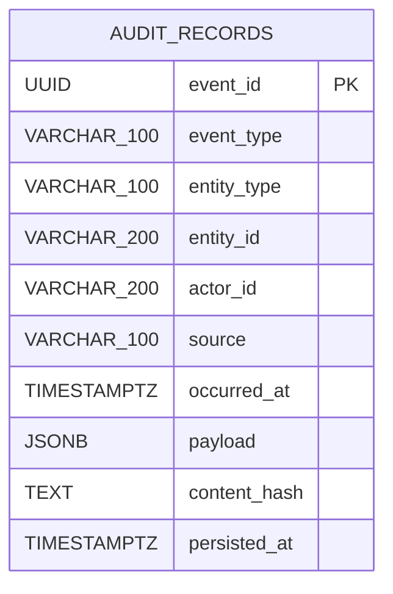

> Links: [[README]] · [[07-dicionario-de-dados]] · [[08-diagramas-classe]]

# 3. DER — Diagrama Entidade-Relacionamento

| Entidade | Papel | Chave/restrições | Relacionamentos |
|---|---|---|---|
| `audit_records` | Registro persistido e imutável do experimento | `event_id` é PK; demais campos exceto `persisted_at` são `NOT NULL`; índice em `entity_id` | Nenhuma FK ou outra tabela de domínio |

O banco não possui relação entre entidades porque há somente uma tabela de domínio. Mensagens de Kafka e DLQ são dados do broker, não entidades relacionais; desenhá-las como tabelas produziria um DER falso. `persisted_at` recebe `clock_timestamp()` na inserção e pode ser nulo para compatibilidade com a semântica de linhas históricas do protótipo. Na base nova da versão Java, a coluna é criada desde V1. A migração é [V1__create_audit_records.sql](../../audit-storage/src/main/resources/db/migration/V1__create_audit_records.sql).
