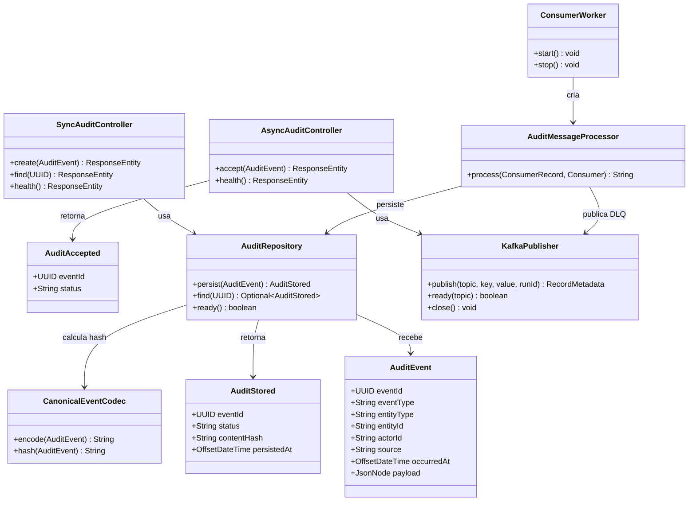

> Links: [[README]] · [[03-der]] · [[07-dicionario-de-dados]] · [[09-diagramas-sequencia]]

# 8. Diagrama de classes — componentes centrais

O diagrama representa dependências de código, não tabelas adicionais. `AuditEvent` e as respostas são records imutáveis. A API síncrona não usa `KafkaPublisher` em execução; a API assíncrona não usa `AuditRepository`. `ConsumerWorker` cria sessão Kafka e `AuditMessageProcessor`, não uma segunda implementação das regras de persistência.
