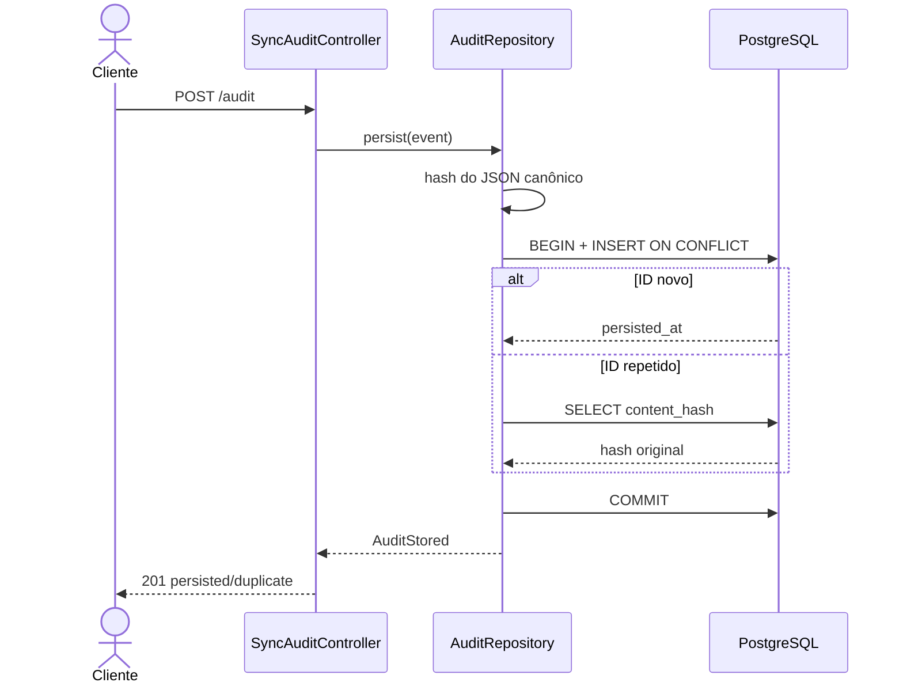
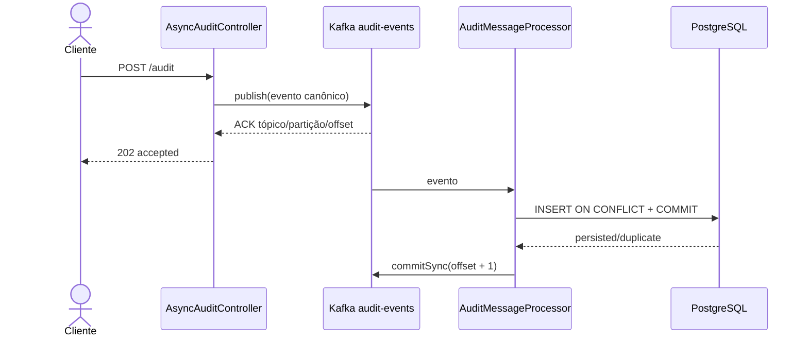
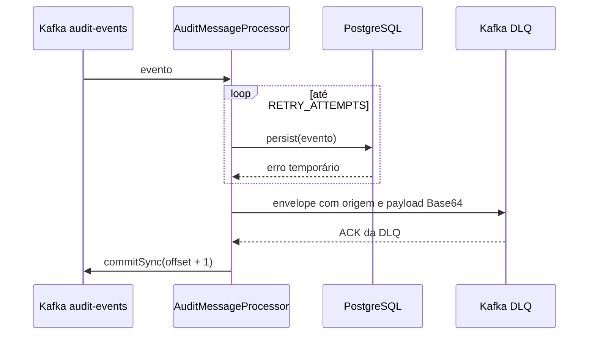

> Links: [[README]] · [[08-diagramas-classe]] · [[05-casos-de-uso/uc001-registrar-sincrono]] · [[05-casos-de-uso/uc003-consumir-evento]]

# 9. Diagramas de sequência

## 9.1 Registro síncrono

Se o hash original divergir, o repositório aborta a transação e a API responde `409`. Em falha de banco, responde `503` com aceitação incerta.

## 9.2 Aceitação e persistência assíncronas

O espaço entre `202` e commit do PostgreSQL é intencional. Para medir fim a fim, usar `commit_completed.wall_time_ns`, não a latência HTTP do `202` isoladamente.

## 9.3 Exaustão de tentativas e DLQ

Sem ACK da DLQ, o último passo não ocorre. Se o ACK da DLQ ocorrer e o commit do offset falhar, a mensagem de origem pode ser reentregue e gerar outra entrada na DLQ; `source_message_id` identifica a origem para reconciliação.
